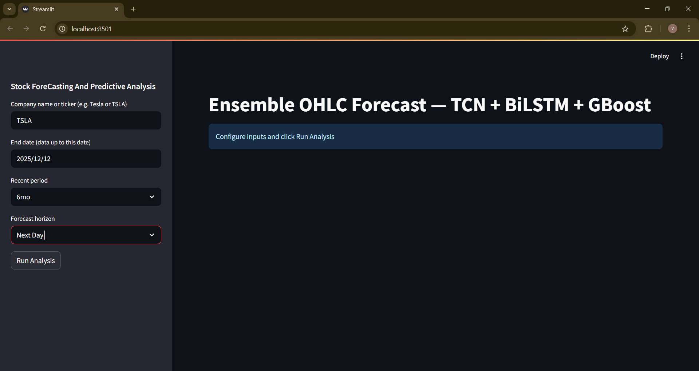

# STOCK PREDICTION ANAYSIS AND FORECASTING SYSTEM.

>**This is a multimodel deep learning model which uses ensemble approach which is used for showing predictive and forcasting analysis on stock data.**

Images from the project are:
- StreamLit Dashboard

- Stock Data

- Predictive Analysis

- Forecasting Table

- Forecasting Charts

- Charts Utilities

- Model Utilities

- Ticker Untilities

- Code for creating dashboard

## Project Overview
This is a comprehensive machine learning model which stimulates real world stock market predictive analysis which allows the model to forcast future movements of the market.
This Project demonstrates Proficiency in **data collection**,**data visualization**,**Data analytics**,**Model creation**,**Dashboard designing**,**Predictive analysis**,**Forecasting Trends**- which are the key skills required by a Data Analyst and a Data Scientist.

### Investor Problem
The New as well as Old investors face difficulty to invest in a Company because They:
- Cannot understand the trends.
- Cannot analyze historical Data.
- Cannot visualize growth.
- cannot compare markets and their predictied trends in one place.

This causes:
- Loss of hard earned money.
- Poor financial growth.
- Loss of precious time.

**Challenges:** New investors cannot decide the time to invest in the markets which causes them to loose money and time.

**Solution:** A Predictive analysis model which can use use previous data od any market in the world and forecast future trends and values making it easier for the investors to invest in the market and earn porfit.

## Key Features

### **Stock market data collection and visualization**
- This Model uses all the markets data which can be used by user to visualize and analyze.
- This Model uses Streamlit Dashboard to show the visualization and give the result to the analysis.

### **Ensemble Approach**
This Approach is used in this model for using multiple models which helps the model to predict and forcast values more accurately.

Models used in this Project are:

- Temporal Convolution Network Model (TCN)
- Bi-Direactional Long Short Term Memory Model (BiLSTM)
- Gradient Boost Model (GBoost)

### **Statistical Analysis**
This Model use Multiple type of Statistical Analysis used for easy data understanding by the model.Some Statistical Analysis are:

- Data Scaling Using Robust Scaler
- Data Regression
- Data Normalization
- Data inversion

### **Predictive Analysis**
- This Model uses 80:20 Split for Data Training and Testing.
- This Model uses different Statistical methods.
- This Model uses different Models.

## Tech Stack
Category                 :      Technologies 

**Data Collection**      :       yfinance

**Language**             :       Python 3.10.11

**Data Analysis**        :       Pandas, Numpy, scikit-learn

**Visualization**        :       Plotly

**Dashboard**            :       Streamlit

**Deep Learning Models** :       TCN, BiLSTM, GBoost

**Development**          :       VS Code

**Approach**             :       Ensemble 

**Version Control**      :       GitHub, Git

## Project Structure

Folder Structure 

## Skills Demonstrated

### Technical Skills

**Python Development**
- Object Oriented Programming
- Pandas for data manipulation
- Error Handling

**Data Manipulation**
- Predictive Analysis Using multiple deep learning models
- Using multiple Statistical methods for Scaling, Normalizing, and Data inversion
- Using Train and Test split for Predictive Analysis.

**Machine learning Proeficency**
- Using Multiple Models
- Data forcasting
- Used ensemble approach
- Data-driven Prediction

**Automation**
- Using Interactive Dashboard
- Using Plotly for Visualization

### Soft Skills
- Problem-Solving and analytical thinking
- Communication through documentation
- Project organisation and structure
- Self-Directed Learning
- Project-Based Learning

## Project Metrices
- **Lines Of Code:** 500+
- **Development Time:** 7 days

## Contact
**Vishank Tyagi**
- Email: tyagivishank1234@gmail.com
- LinkedIn: https://www.linkedin.com/in/vishank-t/
- GitHub: https://github.com/VishankTyagi07

## Star This Repository
If you found this project helpful or interesting,please consider giving it a star! It helps others to discover the project.

**Built with :heart: by Vishank Tyagi | December 2025**

*This Project Demonstrates Skills for Model Building using Ensemble approach byt using multiple models for predictive analysis and Data Forecasting Which are very important in Data Analyst, and Data Scientist Roles*

## License & Usage

This project is **NOT open-source**.

All rights are reserved by the author. Reuse, copying, modification,
or redistribution of this repository or its contents is strictly
prohibited without explicit permission.